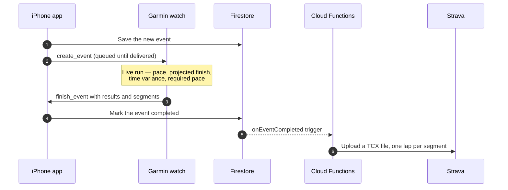
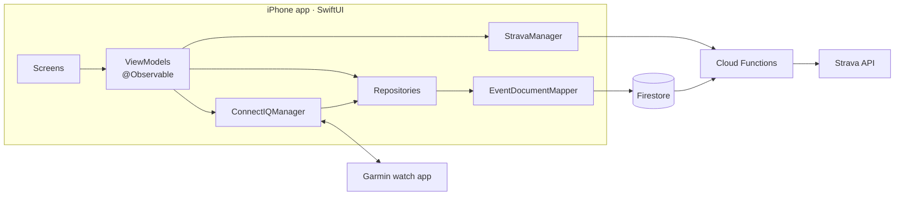

<div align="center">


# PaceApp for iOS

**Set a goal finish time. Your Garmin paces you on the run, and your iPhone keeps every result.**


-2FF99C)

[Website](https://paceapp.net) · [FAQ](https://paceapp.net/faq.php) · [Watch app repo](https://github.com/wvellc/PaceApp-Garmin) · [Architecture notes](CLAUDE.md)

</div>

---

## Contents

- [What it does](#what-it-does)
- [How a run flows](#how-a-run-flows)
- [Architecture](#architecture)
- [Tech stack](#tech-stack)
- [Getting started](#getting-started)
- [Firebase](#firebase)
- [Garmin watch sync](#garmin-watch-sync)
- [Strava](#strava)
- [Project structure](#project-structure)
- [Conventions](#conventions)
- [Known limitations](#known-limitations)
- [Further reading](#further-reading)

---

## What it does

PaceApp is a native iOS companion for runners and walkers who race against a goal time. You plan an event on the phone or the watch, the Garmin app coaches you live during the run (projected finish, time variance, required pace), and the finished result lands back in the app, in Firebase and, if connected, on Strava.

| | Feature | What you get |
|---|---|---|
| 🎯 | **Goal-based events** | Distance in km or miles, a goal finish time, optional segments with their own distance and goal, and look-back intervals. Duplicate any finished run's plan into a new event. |
| ⌚ | **Garmin pairing & sync** | Events created on either side appear on both. Edits and deletes follow, and phone changes wait in a queue until the watch confirms them. |
| ⚙️ | **Two-way settings** | Units, vibrate/beep alerts and step length (worked out from your height) stay in step between the app and the watch. |
| 🏠 | **Home at a glance** | Upcoming events with swipe actions, plus your last run's heart rate, distance, finish time, time variance, pace and goal. |
| 📜 | **History** | Finished runs with filters (distance, date, location), favorites, per-segment results, interval paces, average pace, time variance and pace % of goal. |
| 📊 | **Stats** | Trends by week, month or year: average and best pace, effort and more. |
| 🟠 | **Strava** | Connect once and finished runs upload automatically, with each segment as a Strava lap. Resync or disconnect from Settings. |
| 🔐 | **Sign-in & security** | Phone OTP or email sign-in link. Deleting or disabling the account elsewhere signs this device out, and account deletion re-authenticates inline. |

---

## How a run flows



---

## Architecture



| Area | How it works |
|---|---|
| **UI & state** | SwiftUI with the Observation framework (`@Observable`). The target defaults to MainActor isolation. |
| **Navigation** | One `Router.shared` drives push navigation and root flows. Tab detail screens are pushed through `TabNavigationState`, above the tab view. |
| **Data** | One Firestore document per event, with segments embedded. Every raw watch payload is parsed in one place: `EventDocumentMapper`. |
| **Watch sync** | Loads phone state before handling any watch message, sends one message at a time, and keeps a persisted outbox that clears only on a confirmed send. |
| **Deletes** | Real deletes (app, watch `delete_event`, pending watch deletes) soft-delete in Firestore. The watch's bulk tombstone list stays local-only. |
| **Strava** | The app only runs the OAuth authorize step. Cloud Functions hold the secret, refresh tokens and upload runs, so the device never stores a Strava token. |

---

## Tech stack

| Layer | Technology | Version |
|---|---|---|
| App | Swift, SwiftUI, Observation, MapKit | iOS 17.0+ |
| Tooling | Xcode, Swift Package Manager | Xcode 26+ |
| Backend | [Firebase iOS SDK](https://github.com/firebase/firebase-ios-sdk) (Auth, Firestore) | 12.14.0 |
| Watch | [Garmin ConnectIQ Companion SDK](https://github.com/garmin/connectiq-companion-app-sdk-ios) | 1.8.0 |
| Logging | [swift-log](https://github.com/apple/swift-log) | 1.13.1 |
| Phone sign-in | [CountryPicker](https://github.com/SURYAKANTSHARMA/CountryPicker) | 5.0.2 |
| Server | Cloud Functions for Firebase (Node.js) | Node 20 |
| Design | Gilroy font family, neon aqua on navy palette | — |

---

## Getting started

### Requirements

- **macOS with Xcode 26 or later.** The project uses default MainActor isolation, which needs Xcode 26.
- **An iOS 17+ simulator or iPhone.**
- **For watch pairing:** a real iPhone with the Garmin Connect app, and a Garmin watch running the PaceApp watch app.
- **For backend work:** the Firebase CLI with access to the `thepaceapp` project.

### Run the app

```bash
git clone https://github.com/wvellc/PaceApp-ios.git
cd PaceApp-ios
open PaceApp.xcodeproj
```

Swift packages resolve automatically. Pick the **PaceApp** scheme and run.

### Build from the command line

```bash
xcrun simctl list devices available
```

```bash
xcodebuild -project PaceApp.xcodeproj -scheme PaceApp -destination 'id=<simulator-udid>' build
```

> [!NOTE]
> There is **no test target**, so changes are verified by building. The Firebase client config (`GoogleService-Info.plist`) is included in the repo.

---

## Firebase

Project **`thepaceapp`** (Blaze plan).

| Service | Used for |
|---|---|
| **Authentication** | Phone OTP and email sign-in links |
| **Firestore** | Profiles, events, favorites and Strava state (500 MB offline cache on device) |
| **Cloud Functions** | Strava token exchange, uploads, webhook and the OAuth callback |
| **Hosting** | Email sign-in page, universal-link association files, `/stravaCallback` rewrite |

### Collections

| Collection | Contents | Access |
|---|---|---|
| `users/{uid}` | Profile, gait, units, alert settings, Strava summary | Owner only |
| `events/{eventId}` | Event plan, results, embedded segments, sync status | Owner only |
| `favorites/{favoriteId}` | Favorited events | Owner only |
| `stravaTokens/{uid}` | Strava OAuth tokens | Server only |

### Deploy (from the repo root)

```bash
firebase deploy --only firestore:rules,firestore:indexes
```

```bash
firebase deploy --only functions
```

```bash
firebase deploy --only hosting
```

---

## Garmin watch sync

The watch app lives in its own repo: **[wvellc/PaceApp-Garmin](https://github.com/wvellc/PaceApp-Garmin)** (Monkey C). Message and field names are shared, so change both sides together.

| Message | Direction | Purpose |
|---|---|---|
| `sync_request` | Both ways | Ask the other side for a full sync (the watch sends it whenever its app opens) |
| `sync_all` | Both ways | Full list of active, completed and deleted events |
| `create_event` | Both ways | A new or edited upcoming event |
| `finish_event` | Both ways | A completed run with its results |
| `delete_event` | Both ways | A deleted event |
| `sync_settings` | Both ways | Units, alerts, step length and body metrics |
| `request_settings` | Phone → watch | Ask the watch for its settings and body metrics |

> [!IMPORTANT]
> The watch keeps only **5 active and 3 completed events** and **50 deleted ids**, so a full sync sends the newest of each and strips GPS coordinates.

---

## Strava

1. **Connect:** the user taps **Connect with Strava**, which opens the Strava app or the browser to authorize.
2. **Return:** Strava returns to `https://thepaceapp.web.app/stravaCallback/`, a universal link that opens the app.
3. **Token exchange:** Cloud Functions swap the code for tokens and store them server-side.
4. **Upload:** when a run is completed, `onEventCompleted` uploads it as a TCX file (one lap per segment) and sets the name, sport type and description.
5. **Revoke:** if access is revoked on Strava, the connection is cleared the next time Strava rejects the token. The webhook handler is built, but it only kicks in once the push subscription is registered (see the backlog).

Setup guide: [`functions/STRAVA_SETUP.md`](functions/STRAVA_SETUP.md) · Backlog and limits: [`STRAVA_TODO.md`](STRAVA_TODO.md)

---

## Project structure

```text
PaceApp-ios/
├── PaceApp.swift · AppDelegate.swift   # App entry, Firebase + ConnectIQ setup, deep-link routing
├── Router/                             # Router.shared, Destinations, root flows
├── Model/                              # EventDocument, UserModel, RunSegment, WatchOutboxEntry, enums
├── Modules/
│   ├── Auth/                           # Splash, welcome, login, OTP, authenticating
│   ├── CreateAccount/                  # Onboarding: profile, watch pairing, gait, Strava
│   └── Dashboard/
│       ├── Home/                       # Home, new event, edit, event details, favorites, metrics popup
│       ├── History/                    # Completed runs, filters, paging
│       ├── Analytics/                  # Stats by week, month and year
│       ├── Profile/                    # Profile, manage watch, gait, Strava
│       ├── Settings/                   # Settings, account deletion, legal pages
│       └── Notifications/
├── DesignSystem/                       # Font tokens, gradients, AppButton, AppTextField, toasts, alerts
├── Utility/
│   ├── Manager/                        # Auth, Firestore repositories + mapper, ConnectIQ, Strava, session
│   ├── Constant/ · Extensions/ · Helpers/ · Modifier/
├── Resources/                          # Assets, colors, Gilroy fonts, Localizable.xcstrings
├── functions/                          # Strava Cloud Functions (Node 20)
├── firebase-hosting/public/            # Email sign-in page + .well-known association files
└── firestore.rules · firestore.indexes.json · firebase.json
```

---

## Conventions

| Topic | Rule |
|---|---|
| **Indentation** | Tabs, not spaces |
| **State** | `@Observable` only, never `ObservableObject` |
| **Navigation** | Always `Router.shared`, never a new router |
| **Data access** | Firestore calls go through the repository layer |
| **Styling** | Font tokens (`.semiBold16`) and named colors only |
| **Strings** | User-facing copy lives in `Resources/Localizable.xcstrings` |
| **Comments** | Short single-line `//`, at most two lines together; keep `// MARK: -` sections |
| **Commits** | `type(scope): Summary` in plain, non-technical English, one author, no co-author trailers |

The full set of patterns, pitfalls and verified details is in **[CLAUDE.md](CLAUDE.md)**.

---

## Known limitations

- **No automated tests.** Verification is build-only.
- **Average pace uses the watch's look-back window.** A finished run's average pace covers only the last few whole intervals. The fix is with the watch developer.
- **Watch delete confirmation isn't live yet.** A delete made on the watch while the phone is out of range stays on the watch until the watch app sends its pending deletes.
- **Strava uploads are summary-level.** Laps are included, but there's no GPS route or heart-rate trace. The Strava connected-athlete quota applies.
- **Manual step-length edits are overwritten.** Step length is worked out again from your height on each watch connect.
- **A 0.00 segment is still accepted** mid-event as long as the later segments make up the total.

---

## Further reading

| Document | What's inside |
|---|---|
| [CLAUDE.md](CLAUDE.md) | Architecture, data model, sync rules, conventions and pitfalls |
| [functions/STRAVA_SETUP.md](functions/STRAVA_SETUP.md) | Creating the Strava API app, secrets and deploy |
| [STRAVA_TODO.md](STRAVA_TODO.md) | Strava backlog and known limits |

---

<div align="center">

Built by **[WVE Labs](https://wvelabs.com)** · All rights reserved

</div>
